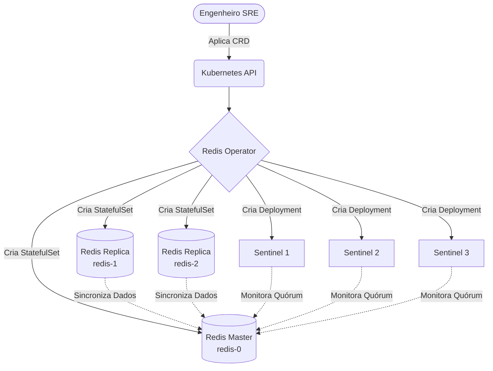

# 🚀 Redis Sentinel Operator

## 📌 Introdução
O **Redis Sentinel Operator** é um controlador Kubernetes customizado (desenvolvido em Go com Kubebuilder) focado em orquestrar a implantação, configuração e resiliência de ambientes Redis em modo de Alta Disponibilidade (HA). 

Diferente de aplicações Stateless, bancos de dados em memória exigem tratamento rigoroso de rede e identidade. Este Operator atua como um SysAdmin automatizado, garantindo o provisionamento de recursos *Stateful*, injeção de configurações de replicação e a inicialização de um quórum de vigilância (Sentinel) capaz de realizar failover automático.

---

## 🧠 Decisão Arquitetural: Sentinel vs. Cluster

O desenvolvimento deste Operator passou por uma análise fundamental sobre a topologia do Redis. Existem duas estratégias primárias para escalar o Redis no Kubernetes:

### Opção A: Redis Sentinel (Alta Disponibilidade Clássica)
* **Arquitetura:** Topologia `Master-Replica` com processos `Sentinel` atuando como monitores de quórum.
* **Escrita/Leitura:** 100% das gravações vão para o Master. As leituras podem ser distribuídas entre as réplicas.
* **Failover:** Se o Master falha, o quórum Sentinel elege e promove uma réplica.
* **Casos de Uso:** Datasets que cabem na memória de um único nó, mas exigem alta disponibilidade (HA) contra falhas de infraestrutura.

### Opção B: Redis Cluster (Sharding e Escala Horizontal)
* **Arquitetura:** Múltiplos nós `Master`, cada um responsável por um subconjunto dos dados (*Hash Slots*), com suas respectivas réplicas.
* **Escrita/Leitura:** O tráfego de gravação é distribuído por todos os Masters da malha. O failover é nativo, sem necessidade de processos Sentinels adicionais.
* **Casos de Uso:** Datasets massivos que excedem a capacidade de RAM de um único nó e exigem alto throughput de gravação (Writes).

Neste projeto, optei por implementar o **Redis Sentinel**, pois o foco principal é dominar a orquestração de processos *Stateful* inter-relacionados no Kubernetes. A construção do Sentinel exige a gestão precisa de identidades fixas (StatefulSets), redes sem balanceamento (Headless Services) e sincronismo na injeção de configurações (`redis.conf` e `sentinel.conf`) para garantir a descoberta dos nós.

---

## 🏗️ Arquitetura (Fluxo de Orquestração)

## 📖 Diário de Desenvolvimento

* **[08/06/2026] - Setup Inicial e Decisão Arquitetural:**

  * Inicialização do módulo Go e scaffolding do Kubebuilder (cloud104.io/v1alpha1).

  * Estudo comparativo arquitetural: Redis Sentinel vs. Redis Cluster.

  * Escolha da topologia Sentinel focada no aprofundamento do tratamento de StatefulSets e Leader Election manual.

  * Elaboração do manifesto do projeto (ADR) e mapeamento visual em Mermaid.